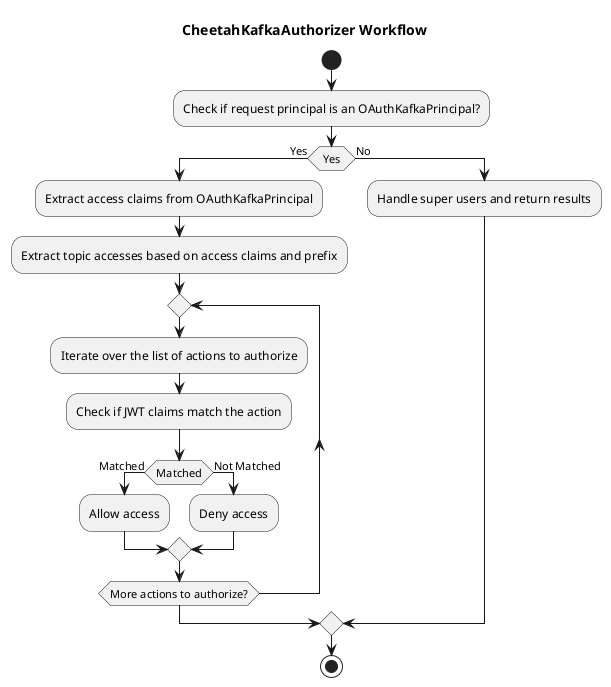

# Cheetah Kafka Authorizer

`CheetahKafkaAuthorizer` is used for claim based access to Kafka.
Access is expressed through claims in a JWT with the following pattern:

```json
{
  "iat": 1679325503,
  "sub": "a252a70e-363e-42aa-a62b-6f7f54d4c8bd",
  ...
  "topics": "*_all, MyTopic_all, YourTopic_read"
}
```

## Workflow

Workflow for CheetahKafkaAuthorizer:




# Deployment

Configure the Claim in JWT to look for topic access by setting:
`cheetah.authorization.claim.name=<claimName>`

If the claims have a prefix before the topic name (i.e. `Kafka_MyTopicName_Read` ), this can be configured by setting:
`cheetah.authorization.prefix=<prefix>`

If the claim is a list of accesses instead of a string of comma seperated accesses you can set:
`cheetah.authorization.claim.is-list=true`

To use the Authorizer package the project using maven:

`mvn package`

Then

`docker build . -t my-kafka`

## Logging
The following types of info is logged on different log levels:
### DEBUG
* SuperUsers(e.g. kafka-entity-topic-operator, kafka-exporter) accesses.
### INFO
* JWT claim has entries which does not follow correct pattern for topic access <prefix>_<topic-name>_<operation>.
### WARN
* JWT does not have the required claim.
