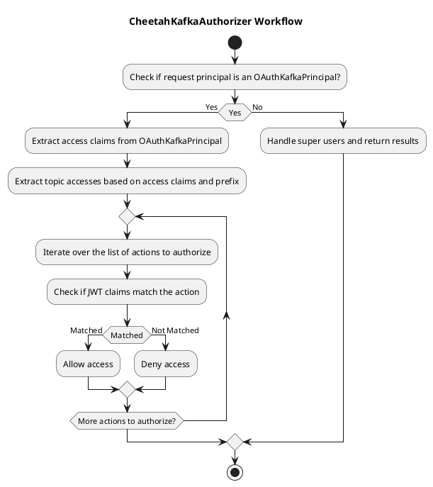
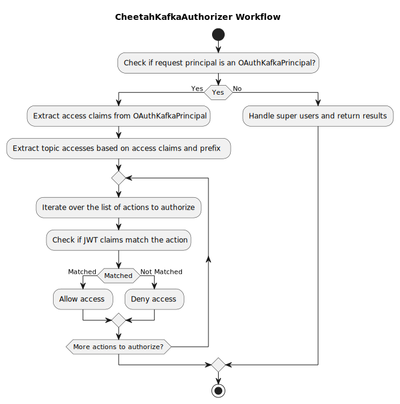

# Cheetah Kafka Authorizer

`CheetahKafkaAuthorizer` is used for claim based access to Kafka. It uses `OAuthKafkaPrincipalBuilder` from <https://github.com/strimzi/strimzi-kafka-oauth/tree/main>. The `OAuthKafkaPrincipalBuilder` extracts the JWT from the request and creates a `OAuthKafkaPrincipal` which is used by `CheetahKafkaAuthorizer` to authorize the request.

Access is expressed through claims in a JWT with the following pattern:

```json
{
  "iat": 1679325503,
  "sub": "a252a70e-363e-42aa-a62b-6f7f54d4c8bd",
  ...
  "topics": "*_all, MyTopic_all, YourTopic_read"
}
```

The `topics` claim is a comma separated list of topic access. Each access is a string with the following pattern:

`<prefix>_<topic-name>_<operation>`

The `<prefix>` is optional and can be configured. The `<topic-name>` is the name of the topic to access. The `<operation>` is the operation to perform on the topic.

The `<operation>` will be directly translated into the Kafka operation. See <https://docs.confluent.io/platform/current/kafka/authorization.html#operations> for more information.  

**NB:** It will be transformed into uppercase before being used and `-` will be replaced with `_`.  
Example: `kafka_mytopic_describe-configs` will be transformed into `DESCRIBE_CONFIGS` ACL operation for the topic called `mytopic`.

## Resource types

### Topics

The `<operations>` acts as a operation group which assigns additional permissions:

Claimed Operations (groups):
* WRITE
* READ
* ALL

gives the following permissions in Kafka:

#### TYPE: READ

Example: `kafka_mytopic_read`

| Kafka Resource | Allows requested Action |
|----------------|-------------------------|
| Topic          | READ, DESCRIBE          |
| Group          | READ, DESCRIBE          |

The `read` operation is a special case as it allows both READ and DESCRIBE on the topic and group.
Use this for services that consume data from Kafka.

#### Type: WRITE

Example `kafka_mytopic_write`

| Kafka Resource | Allows requested Action |
|----------------|-------------------------|
| Topic          | WRITE, DESCRIBE         |
| Group          | DESCRIBE                |
| Cluster        | IDEMPOTENT_WRITE        |

The `write` operation is a special case as it allows both WRITE and DESCRIBE on the topic and group. It is also required to have write accesss to the cluster to allow idempotent producers to produce data to Kafka.  
Use this for services that produce data to Kafka.

#### Type: ALL

Example `kafka_mytopic_all`

| Kafka Resource | Allows requested Action |
|----------------|-------------------------|
| Topic          | *                       |
| Group          | READ, DESCRIBE          |
| Cluster        | IDEMPOTENT_WRITE        |

The `all` operation is a special case as it allows all operations on the topic. This supports producers and consumers and gives them more control over topics, such as altering topic configuration.

### Cluster

if you write <prefix>_cluster_<operation> in the claim, it will be interpreted as a cluster operation, as cluster is a special keyword. The operation will be directly translated into the kafka operation.

## Workflow

Workflow for CheetahKafkaAuthorizer:





# Deployment

Configure the Claim in JWT to look for topic access by setting:
`cheetah.authorization.claim.name=<claimName>`

If the claims have a prefix before the topic name (i.e. `Kafka_MyTopicName_Read` ), this can be configured by setting:
`cheetah.authorization.prefix=<prefix>`

If the claim is a list of accesses instead of a string of comma seperated accesses you can set:
`cheetah.authorization.claim.is-list=true`

To use the Authorizer package the project using maven:

`mvn package`

Then

`docker build . -t my-kafka`

## Logging
The following types of info is logged on different log levels:
### DEBUG
* SuperUsers(e.g. kafka-entity-topic-operator, kafka-exporter) accesses.
### INFO
* JWT claim has entries which does not follow correct pattern for topic access <prefix>_<topic-name>_<operation>.
### WARN
* JWT does not have the required claim.
